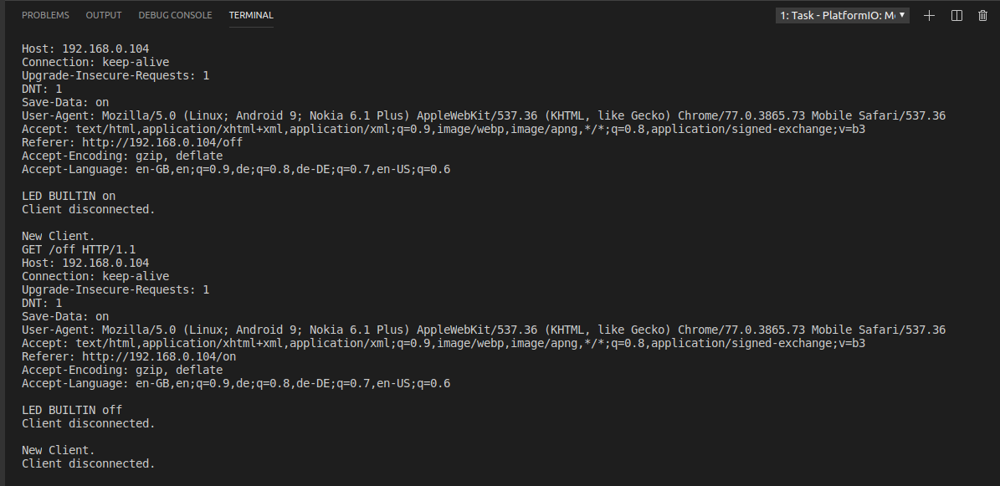

# nodemcu.webServer

With this NodeMCU project, I will attempt to

1. Connect ESP8266 with home Wifi
2. Run webserver on NodeMCU
3. write webservice to turn builtin LED ON/OFF using HTTP paths 

## Enhancements todo

1. [ ] Read username and passwrod from Environment variables for security reasons
2. [ ] Use vue-js
3. [ ] Use NetworkManaget to connect to WiFi
4. [ ] Write tests